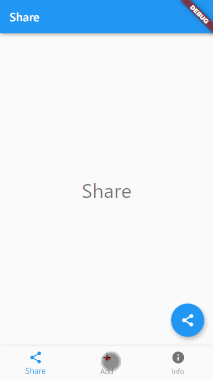

# bottom_navigation_scaffold

Build bottom navigation layout easier.

Feature
- Manage bottom navigation status, e.g. page selection, holding page and corresponding elements, etc.
- Swip to change page
- Provide (seems to be) more material style element transistion

## Preview



## Getting Started

### 1. Add package

```yaml
dependencies:
  bottom_navigation_scaffold: ^0.0.1
```

### 2. Add the widget from package to root screen

```dart
import 'package:bottom_navigation_scaffold/bottom_navigation_scaffold.dart';

// usually in build method

  return BottomNavigationScaffold(
    bottomNNavigationBarBuilder: (context, tabs, currentIndex, signalUpdate){},
    pageDetails: [],
  );
```

### 3. Declare the page content, tab, floating action button (if applicable) and app bar (if applicable) for each page

```dart
pageDetails: [
  PageDetail(
    pageAppBar: AppBar(
      key: Key("share"),
      title: Text('Share'),
    ),
    page: PageWidget(title: 'Share'),
    tab: BottomNavigationBarItem(icon: Icon(Icons.share), label: "Share"),
    floatingActionButton: FloatingActionButton(
      key: Key("share"),
      onPressed: () {},
      tooltip: 'Share',
      child: Icon(Icons.share),
    ),
  ),
  PageDetail(
    pageAppBar: AppBar(
      key: Key("add"),
      title: Text('Add'),
    ),
    page: PageWidget(title: 'Add'),
    tab: BottomNavigationBarItem(icon: Icon(Icons.add), label: "Add"),
    floatingActionButton: FloatingActionButton(
      key: Key("add"),
      onPressed: () {},
      tooltip: 'Add',
      child: Icon(Icons.add),
    ),
  ),
  PageDetail(
    page: PageWidget(title: 'Info'),
    tab: BottomNavigationBarItem(icon: Icon(Icons.info), label: "Info"),
  ),
],
```

### 4. Add the bottom navigator bar

If not using the tab bar widget, remember to call the method `signalUpdate` to refresh the floating action button and app bar.

```dart
bottomNNavigationBarBuilder: (context, tabs, currentIndex, signalUpdate){
  return BottomNavigationBar(
    onTap: (i) => signalUpdate(i),
    items: tabs,
    currentIndex: currentIndex,
  );
},
```

> ⚠ Since this comes with a scaffold, do not add your own scaffold, or you will run into multi-scaffold troubles.

## TODO

- [ ] Unit tests
- [ ] Toggle bottom navigation bar visibility
- [ ] Expose selected index properly
